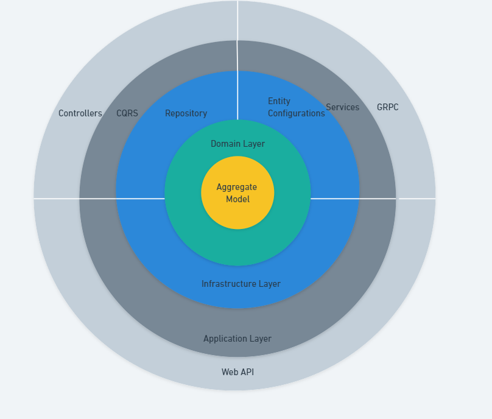

# EmpowerId Microservice

## Overview

This README provides an architectural explanation of the project, detailing the implementation of a Onion-layer architecture with the Command Query Responsibility Segregation (CQRS) pattern. Additionally, the project leverages Google Protobuf for efficient data serialization and Redis caching for optimized data retrieval.

## Key Components:
### Diagram

### Onion-layer Architecture:
The project follows the principles of Onion-layer architecture, emphasizing modularization, separation of concerns, and maintainability. The codebase is organized into distinct layers, promoting a clear and scalable structure.

### CQRS Pattern:
The Command Query Responsibility Segregation (CQRS) pattern is employed to separate the write and read operations, enhancing performance and scalability. Commands and queries are handled by dedicated components, providing flexibility and improved maintainability.

### Google Protobuf:
Google Protobuf (Protocol Buffers) is utilized for efficient and language-agnostic data serialization. This allows for streamlined communication between components and services, minimizing payload size and improving overall system performance.

### Redis Caching:
Redis caching is integrated into the system to optimize data retrieval. Cached data can be quickly accessed, reducing the need for redundant database queries and improving response times. This enhances the overall system's responsiveness and scalability.

## Setup Local development environment

What you need?
 - Windows 10+
 - Visual Studio Community (or paid version)
 - SQL Server 2019+
 - Docker Desktop

## Configure AppSettings.json
 - Configure your connection string:

 `"ConnectionStrings": {
  "DefaultConnection": "Server=.;Initial Catalog=EmpowerId;MultipleActiveResultSets=True;User Id=sa;Password=123;Encrypt=False"
}`

- Configure the gRPC URLs by ensuring that the server URL and client URL match. For instance, if the API is hosted at localhost:7041, update the following configuration accordingly: 

`"GrpcServices": {
  "PostGrpcServiceUri": "https://localhost:7041",
  "CommentGrpcServiceUri": "https://localhost:7041"
}`

 - Initialize a local Redis server on the default port `6379` or deploy it using Docker. If opting for Docker, ensure you have executed the `docker pull redis` command in the command prompt. To run Redis in Docker, use the following command in the command prompt while in the solution folder path:

 `docker run --name empowerid-redis  -p 6379:6379 -d redis`

#### Ensure Dependencies:
Make sure that all project dependencies are installed. This typically includes Entity Framework tools and any required database providers.

#### Apply Migrations:
Run the following command in the Package Manager Console to apply any pending database changes:

`Update-Database`

Ensure that the Package Manager Console is open and the default project is set to the one containing your DbContext.

